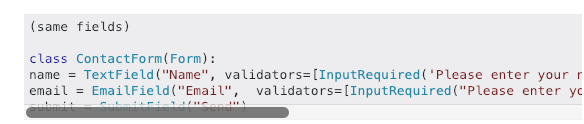
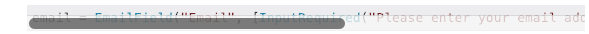
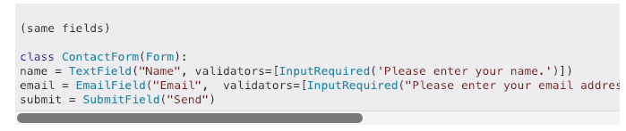
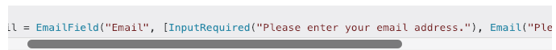

### Chrome extension for stackoverflow

This chrome extension fixes an issue where the bottom scrollbar blocks the last line of stackoverflow pre text or blocks of code. Pretty annoying right?

> [Find it on chrome webstore](https://chrome.google.com/webstore/detail/stack-overflow-padding/fblinjehcjdhoilblhogpjpcadkceamj)

If you don't know what i'm talking about here is a screenshot:

here is another. 😱 how am I gonna read that one liner now?:  

I know what you are gonna say..

"But MacOs auto hides scrollbars by default 🙄"

Well who is this MacOs you speak of?...... 😂 😂 😂 😂 😂 😂

Sometimes it doesn't work and it gets more annoying every time you encounter it.

##### Are you waiting for superman?

It is I, the much anticipated hero here to add some padding.  
Also I couldn't find a way to give feedback to stackoverflow. 🧐

Here is how the fixed one looks like:

and I saved the one liner too: 🤓

### Here is how to set up, or not, I don't know what you want to do. It's not like I can read minds or anything like that, or can I. 👀

- Clone this repo or download it, or copy every file one by one.
- Open chrome or switch to it if you had it Open
- Enter `chrome://extensions/` on a new tab or an old one.
- Click on `load unpacked` and look for this extension wherever you cloned it to. If you don't know where, you are wrapped helically around an inclined plane 🔩. Coz you have to clone it again or something.
- Once you are done, The extension should work every time you are on stackoverflow.
- If you make a change on the extension you have to refresh it, every time 🔄.

*** Insert celebrating noises here ***

👀

*** Celebrating Noise intensify ***
